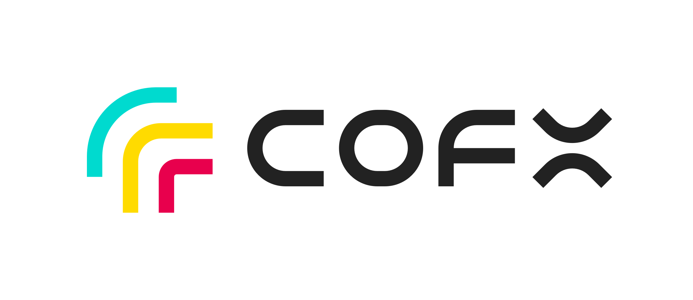
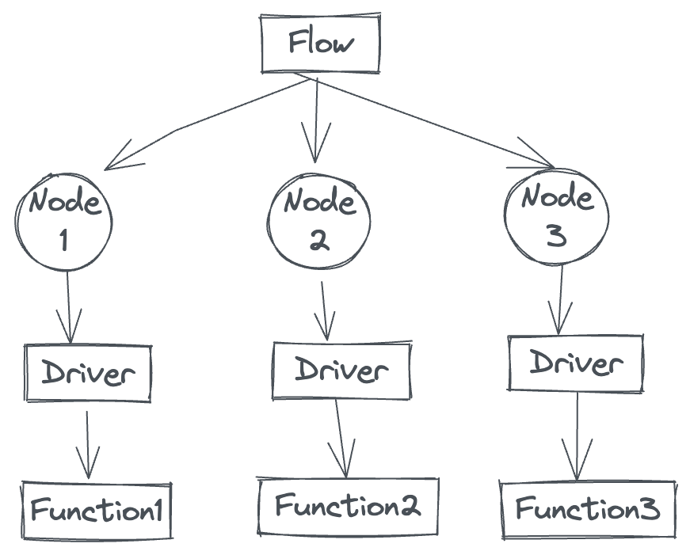

# CoFUNC

[[中文](./README.zh_CN.md)]

CoFUNC is an automation engine based on function fabric, which can build automated function flows of various capabilities through the combination of functions. flowl is a function fabric language embedded in CoFUNC, which provides functions such as function events, function operation and management from the language.

## :rocket: FlowL
Flowl is a small language dedicated to function fabric; the syntax is very minimal and very simple. Currently, it supports function load, function configuration fn, function operation, variable definition, string embedded variable, for loop, switch conditional statement, etc.

### Hello World
helloworld.flowl code content:
```go
// cat examples/helloworld.flowl

load "go:print"

var a = "hello world!!!"

co print {
    "_" : "$(a)"
}

```

Run the code:

```
➜ cofunc run examples/helloworld.flowl
hello world!!!
```

The flowl source file needs to use the `.flowl` extension to be executed.

### Grammar Introduction
#### Comment
Use `//` to add code comments. :warning: Note that only exclusive line comments are provided, no end-of-line comments.

#### :balloon: load
load is used to load a function, for example: load the print function print

```go
// go is a function driver, which means that the function print is a piece of Go code and needs to be run by the go driver
// print is function name
load go:print
```

All functions need to be loaded before they can be used.

#### :balloon: fn
fn configures a function and configures the parameters required for the function to run, such as:

```go
// t is the function alias
// time is the real function name
fn t = time {
    args = {
        "format": "YYYY-MM-DD hh:mm:ss"
    }
}
``` 

args is a built-in function configuration item, which represents the parameters passed to the function when the function is running. The fixed type of function parameters is string-to-string KVs, which corresponds to map[string]string in Go language, and the same for other languages. :warning: Note: The parameter KV received by each function is different, you need to check the specific usage of the function.

#### :balloon: co
co is taken from the prefix of coroutine, and is also similar to the go keyword of the Go language. The co keyword is to start running a function. For example: use co to run the print function, output Hello World!

```go
fn p = print {
    args = {
         "_" : "Hello World!" 
    }
}

co p
```

Multiple functions can be combined in a flowl source file, so co provides the ability to execute multiple functions serially and in parallel.

```go
// serial execution
co funciton1
co function2
co function3
```

```go
// parallel execution
co {
    function1
    function2
    function3
}
```

```go
// Serial-parallel hybrid
co function1
co {
    function2
    function3
}
```

#### :balloon: for loop
TODO:

#### :balloon: variable
The `var` keyword can define a variable, :warning: Note: The variable itself has no type, but the built-in default distinguishes between strings and numbers, and numeric variables can perform arithmetic operations.

```go
var a = "Hello World!"
var b = $(a)
var c = (1 + 1) * 2
var d = $(c) * 2
``` 

:warning: Note: var can be used in global, fn, and for scopes, but not in run.

The `<-` operator is used for variable rewriting (usually called assignment in other languages)

```go
var a = "foo"
a <- "bar
// <- After rewriting the variable, the value of the a variable becomes bar
```

## :bullettrain_side: standard library
- :white_check_mark: print
- :black_square_button: sleep
- :white_check_mark: command
- :white_check_mark: time
- :black_square_button: git
- :black_square_button: github
- :black_square_button: gobuild
- :black_square_button: HTTP Request
- ...

The standard library support is completely arranged according to my personal daily use tools

## :bangbang: some important design rules
TODO:

## :pushpin: TODOs
Language
* ...

Driver
* Support shell driver
* Support Javascript driver
* Support Rust driver
* Support Docker driver
* Support Kubernetes driver
* ...

tool
* Function usage
* Function development rack
* cofunc-server
* repository

## Installation and configuration
TODO:

## Architecture Design
### Core concept


There are 4 core concepts in CoFUNC architecture design, namely `Flow`, `Node`, `Driver` and `Function`

* Flow is a flow written and defined with a `.flowl` file
* Node is the entity that constitutes a Flow, the object that actually executes and manages Function
* Driver is the place where the function code is actually executed at the bottom layer. It defines how a function is developed, how to run, where to run, etc.; for example: when we need to add Rust language to develop functions, then we need to implement a Rust driver first
* Function is the real function, it can be a Go package code, a binary program, a shell script, or a Docker image, etc.

### flowl


flowl adopts the implementation method of lexical and grammar separation. After the syntax analysis is completed to obtain an AST tree, the AST is converted into a run queue of functions. Based on the run queue, functions can be executed in order.

## Contribution
TODO:
