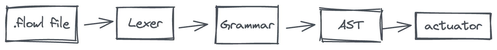

[[中文](./README.zh_CN.md)]

CoFx is an automation engine that uses low-code programming to build personal automation workflows, so that turn boring suff into low code. The CoFx framework engine consists of two parts, the programming language and the standard function library.


- [Installation Guide](#installation-guide)
- [CLI](#cli)
- [FlowL - A small language](#flowl---a-small-language)
  * [Hello World](#hello-world)
  * [Grammar Introduction](#grammar-introduction)
    + [Comment](#comment)
    + [load](#load)
    + [var](#var)
    + [fn](#fn)
    + [co](#co)
    + [switch](#switch)
    + [event](#event)
    + [for loop](#for-loop)
- [Standard Library](#standard-library)
- [TODOs](#todos)
- [Architecture Design](#architecture-design)
  * [Runtime Core Concepts](#runtime-core-concepts)
  * [flowl](#flowl)
- [Contribution](#contribution)
- [Thanks](#thanks)

<small><i><a href='http://ecotrust-canada.github.io/markdown-toc/'>Table of contents generated with markdown-toc</a></i></small>

## Installation Guide
Currently, an installation package is not provided yet, but you can try it through building the source code by yourself.

To build the source code, execute the following command:
````
make first
````

## CLI
```
// cofx -h

An automation engine based on function fabric, can used to parse, create, run
and manage flow

Execute 'cofx' command directly and no any args or sub-command, will list
all flows in interactive mode

Environment variables:
  COFX_HOME=<path of a directory>           // Default $HOME/.cofx

Examples:
  cofx
  cofx list
  cofx run   helloworld.flowl
  cofx prun  helloworld.flowl

Usage:
  cofx [flags]
  cofx [command]

Available Commands:
  help        Help about any command
  list        List all flows that you coded in the flow source directory
  log         View the execution log of the flow or function
  parse       Parse a flowl source file
  run         Run a flowl file

Flags:
  -h, --help   help for cofx
```

## FlowL - A small language
Flowl is a small language that be used to `function fabric`; The syntax is very minimal and simple. Currently, it supports function load, function configuration, function operation, variable definition and operation, embedded variable into string, for loop, switch conditional statement, etc.

### Hello World
helloworld.flowl code content:
```go
// cat examples/helloworld.flowl

load "go:print"

var a = "hello world!!!"

co print {
    "_" : "$(a)"
}
```

Run the code:


The flowl source file needs to use the `.flowl` extension to be executed.

### Grammar Introduction
#### Comment
Use `//` to add code comments. :warning: Note that only exclusive line comments are provided, not support end-of-line comments.

#### load
load is used to load a function, for example: load the function 'print'

```go
// go is a function driver, which means that the function print is a piece of Go code and needs to be run by the go driver
// print is the function name
load go:print
```

All functions need to be loaded before they can be used.

#### var
The `var` keyword can define a variable, :warning: Note: The variable itself has no type, but the built-in default distinguishes between strings and numbers, and numeric variables can perform arithmetic operations.

```go
var a = "Hello World!"
// $(a) means to get the value of the variable a
var b = $(a)
var c = (1 + 1) * 2
var d = $(c) * 2
``` 

> `var` can only be used in global and fn scopes

The `<-` operator is used for variable rewriting (usually called assignment in other languages)

```go
var a = "foo"
a <- "bar"
// <- Rewriting the variable, the value of the variable 'a' becomes bar
```

> `<-` can be used in global, fn, for scopes

#### fn
fn configures a function and configures the parameters required for the function to run, such as:

```go
// t is the function alias
// time is the real function name
fn t = time {
    args = {
        "format": "YYYY-MM-DD hh:mm:ss"
    }
}
``` 

args is a built-in function configuration item, which represents the parameters passed to the function when the function is running. The fixed type of function parameters is string-to-string KVs, which corresponds to map[string]string in Go language, and the same for other languages. :warning: Note: The parameter KV received by each function is different, you need to check the specific usage of the function.

> * In the definition of `fn`, the function alias and the real function name cannot be the same
> * `fn` can only be used in the global scope

#### co
co is taken from the prefix of coroutine, and is also similar to the go keyword of the Go language. The co keyword is to start running a function. For example: use co to run the print function, output Hello World!

```go
fn p = print {
    args = {
         "_" : "Hello World!" 
    }
}

co p

```
About function arguments, in the above example function p, `fn + args` is used to pass arguments to the function; in addition to using args in fn to pass in arguments, you can also pass arguments to the function directly in the co statement, e.g.:

````go
fn p = print {
}

co p {
    "_": "Hello World!"
}
````

:warning: Note: The functions do not necessarily to be defined first with fn statement, When using co to execute them (the purpose of fn is to change the default running behavior of the function through configuration), e.g.:

````go
// The print here is not the function alias defined by fn, but the real function name
co print {
    "_": "Hello World!"
}
````

About the return value of function execution, the return value of the function is the same as the arguments of the function, it is a string-to-string KVs structure, that is to say, each function will store its own return value in a map[string]string-like in the structure.

An example of getting the return value of a function:
````go
// set an out variable to receive the return value
var out
// The '->' operator represents the return of the function, so here we can think that out is a variable similar to map[string]string (actually not)
co time -> out

co print {
    // $(out.now) is the value whose key is now in the out KVs (now is a kv of the return value of the time function)
    "_": "$(out.now)"
}
````

Multiple functions can be combined in a flowl source file, so co provides the ability to execute multiple functions serially and in parallel.

```go
// serial execution
co funciton1
co function2
co function3
```

```go
// parallel execution
co {
    function1
    function2
    function3
}
```

```go
// Serial-parallel hybrid
co function1
co {
    function2
    function3
}
```

> `co` can only be used in global, for, switch scopes

#### switch

`switch + case` can choose to execute `co` according to the condition. A case statement contains a conditional expression and a co statement. The following switch statement has two cases:

```go
switch { 
    case $(build) == "true" { 
        co print {
            "go build": "starting to run ..."
        }
    }
    case $(test) == "true" {
        co print {
            "go test": "starting to run ..."
        }
    }
}
```

:warning: Note: As long as the case condition in switch is true, it will be executed, which means that multiple case statements may be executed at one time, or even all of them; it does not stop when matching a case.

> `switch` can be used in global and for scopes

#### event
The `event` statement is used to define an event trigger. When the trigger generates an event, it will trigger the entire flowl to be executed.

```go
event {
    co event_tick -> ev {
        "duration": "10s"
    }
    co event_cron -> ev {
        "expr": "*/5 * * * * *"
    }
}
```

In the event statement, use the co statement to start one or more event functions, which will always wait for the event to occur.

#### for loop
In theory, the `for` statement in flowl, the frequency of using is not too high. In a Flow, we can use the `for` statement to control a function to be executed multiple times.

A for example with condition:
```go
var counter = 0

for $(counter) < 10 {
     // counter increments by 1
     counter <- $(counter) + 1

     // print the value of counter
     co print {
         "_": "$(counter)"
     }

     // execute function sleep, default sleep 1s
     co sleep
}
```

The for statement can also implement an infinite loop without a conditional expression:
```go
for {

}
```

## Standard Library


TODOs:
-  git
-  github
-  HTTP Request
-  MySQL
-  PostgreSQL
-  Redis
-  DingTalk
-  Wechat
-  Slack
- ...

## TODOs
Driver
* Support Javascript driver
* Support Rust driver
* Support Docker driver
* Support Kubernetes driver
* ...

tool
* function development helper
* cofx-server
* repository

## Architecture Design

<div align=center></div>

### Runtime Core Concepts

<div align=center></div>

There are 4 core concepts in cofx architecture design when it's running, namely `Flow`, `Node`, `Driver` and `Function`

* `Flow` is a process that's defined through a `.flowl` file
* `Node` is the entity that makes up a Flow, the node entity executes and manages a Function
* `Driver` is the place where the function code is actually executed. It defines how a function is developed, how to run, where to run, etc. For example, when we need to add Rust language to develop functions, then we need to implement a Rust driver first
* `Function` is the real function, it maybe a Go package code, a binary program, a shell script, or a Docker image, etc.

### flowl

<div align=center></div>

flowl adopts the implementation method of lexical and grammar separation. After the grammar, it will output an AST tree, the AST is converted into a run queue of functions. Based on the run queue, functions can be executed in order.

## Contribution
TODO:
* [How to develop a new driver?]()
* [How to develop a new std function?]()
* [How to develop a new event trigger?]()

## Thanks
TODO: