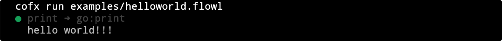

CoFx 是一个自动化引擎，用低代码编程的方式构建个人自动化工作流，让一切无聊的事情都代码化、自动化的被解决。CoFx 框架引擎由编程语言和标准功能函数库两部分组成。


## 功能
* 内置专用的函数流编织语言 flowL
* 常用的函数标准库
* 更符合程序员习惯的 CLI 工具
* 通过函数编织，支持低代码开发 workflow 
* 内置一些默认的 workflow，开箱即用
* 支持函数功能的扩展开发
* 支持 event 触发 workflow 
* ...

## 默认内置 Workflow 
* [github-3way-sync](docs/github_3way_sync.zh_CN.md)：自动同步 Github 项目的 local、origin 和 upstream 三路分支
* [github-auto-pr](docs/github_auto_pr.zh_CN.md)：自动 push 本地分支到 origin，然后再自动创建 pull request 并通过浏览器打开 pull request 详情页
* [go-auto-build](docs/go_auto_build.zh_CN.md)：自动构建一个基于 go mod 的 go 项目，支持自动探测多模块，自动 build
* ...

安装 cofx，使用 `cofx list` 命令查看所有默认内置的 workflow。

## 标准函数库
| 函数名               | 说明                                                         |
| :------------------- | :----------------------------------------------------------- |
| command              | 运行命令或脚本                                               |
| print                | 打印到标准输出                                               |
| time                 | 读取当前时间并返回多个时间值相关的变量                       |
| event/event_cron     | 基于 cron 语法格式的定时事件触发器                           |
| event/event_tick     | 固定间隔 X 秒时间的定时事件触发器                            |
| git/git_add_upstream | 使用 'git remote add' 命令配置 upstream                      |
| git/git_check_merge  | 使用 'git merge-base/merge-tree' 命令检查两个分支是否存在冲突 |
| git/git_fetch        | 使用 'git fetch' 命令更新本地仓库                            |
| git/git_local_info   | 读取本地 git 仓库的常用基本信息                              |
| git/git_pull         | 使用 'git pull' 命令更新本地仓库                             |
| git/git_push         | 使用 'git push' 命令同步本地分支到远程                       |
| git/git_rebase       | 使用 'git rebase' 命令合并分支                               |
| github/gh_create_pr  | 向 upstream 创建 pull request                                |
| go/go_build          | 分析 'go mod' 的 go 项目，并自动构建各个 module              |
| go/go_generate       | 封装 go generate 命令                                        |
| go/go_test           | 封装 go test 单元测试工具                                    |
| http/http_get        | 发送 Http GET 请求                                           |
| http/http_post       | 发送 Http POST 请求                                          |
| ...                  |                                                              |

安装 cofx，使用 `cofx std` 命令查看标准库所有函数；使用 `cofx std 函数名` 查看函数的参数和返回值等具体用法。

## flowL
flowL 是一门小语言，专用于函数编织； 语法非常少，也非常简单。目前已经支持函数 load，函数配置 fn，函数运行、变量定义和运算、字符串嵌入变量、for 循环、switch 条件语句等。

#### Hello World
helloworld.flowl 代码内容：
```go
// cat examples/helloworld.flowl

load "go:print"

var a = "hello world!!!"

co print {
    "_" : "$(a)"
}
```

运行代码：



flowL 代码文件需要使用 `.flowl` 扩展后缀才能够被执行。

[flowL 语法详细介绍](docs/flowl_guide.zh_CN.md)

## 安装
#### MacOS 

```
brew tap cofxlabs/tap
brew install cofx
```

#### 通用安装
从 Release 中下载合适的最新版本，执行如下命令安装：

```
tar zxvf cofx-<your-os-arch>.tar.gz
cd <your-os-arch>
sudo ./install.sh
```

## 开发&贡献
* [架构设计](docs/arch.zh_CN.md)