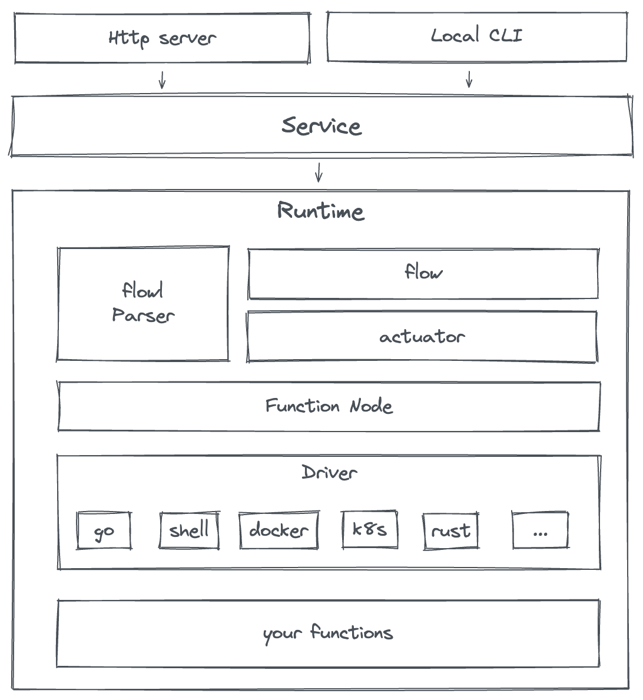
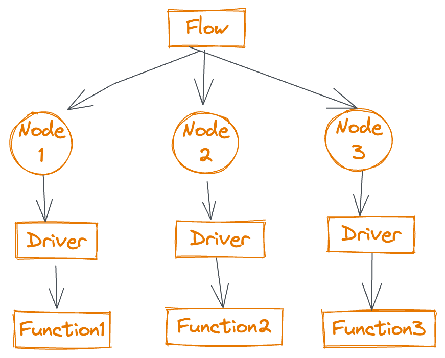
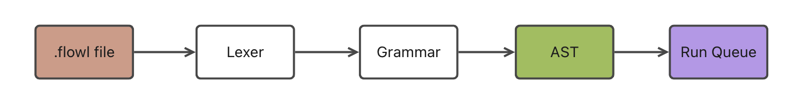

# 架构设计

## 核心概念

cofx 架构设计中有 4 个核心概念，分别是 `Flow`, `Node`, `Driver` 和 `Function`

* Flow 就是用一个 `.flowl` 文件编写、定义的一条流
* Node 就是组成一条 Flow 的实体，实际执行、管理 Function 的对象
* Driver 是位于底层真正执行 Function 代码的地方，它定义了一个 Function 如何开发，如何运行，在哪里运行等等；比如：当我们需要增加 Rust 语言来开发 Function，那么就需要先实现一个 Rust 的 Driver
* Function 就是真正的函数了，它可以是一个 Go package 代码、一个二进制程序、一个 shell 脚本，或者一个 Docker 镜像等等

## flowl

flowl 采用词法和语法分离的实现方式，再语法分析完成得出一颗 AST 树后，再将 AST 转换成函数的运行队列，基于运行队列就可以按序执行函数
