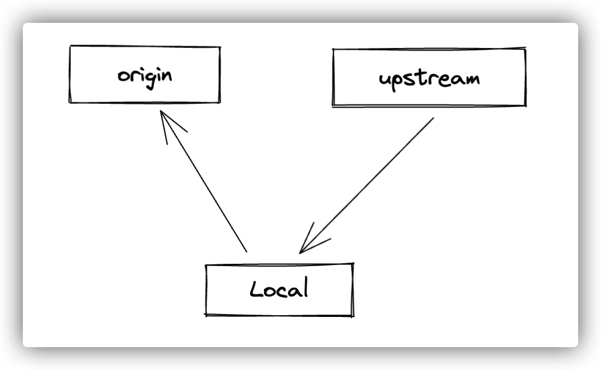
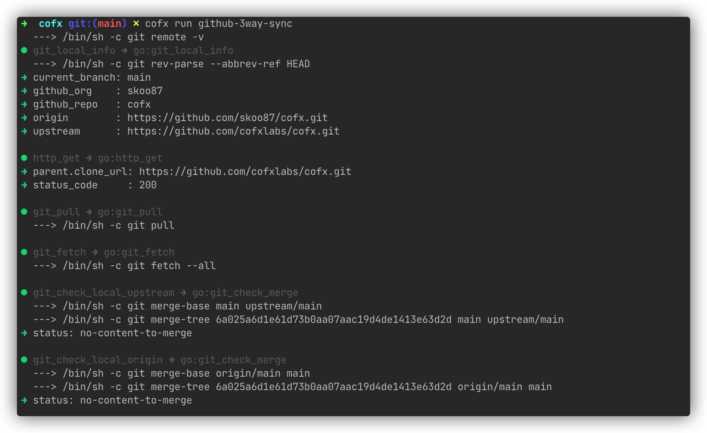

# Github-3way-sync Introduction



## Scenes

When we participate in the development of open source projects on github, it usually involves synchronization with the upstream repository, that is, after the upstream repository of the fork is updated, we need to synchronize to the fork repository (that is, the origin). You can search the Internet to find many articles about how to synchronize github upstream.

Here I completely automate such a relatively cumbersome synchronization process into a automated workflow based on cofx. I named this automated workflow scenario: github-3way-sync, which is three-way synchronization, and the three-way are: local, origin, and upstream.

## Usage

The method of use is very simple, without any configuration. You just need to enter a cloned repository on github, switch to the main or master branch, and execute the following command:

```shell
cofx run github-3way-sync
````

Note: By default, only the main or master branch is supported for synchronization, that is, the main branch of the upstream repository is main or master.

Demonstration:



## FlowL Code

The flowl code for github-3way-sync is at:

[https://github.com/cofxlabs/cofx/blob/main/examples/github-3way-sync.flowl](https://github.com/cofxlabs/cofx/blob/main/examples/github-3way-sync.flowl)
