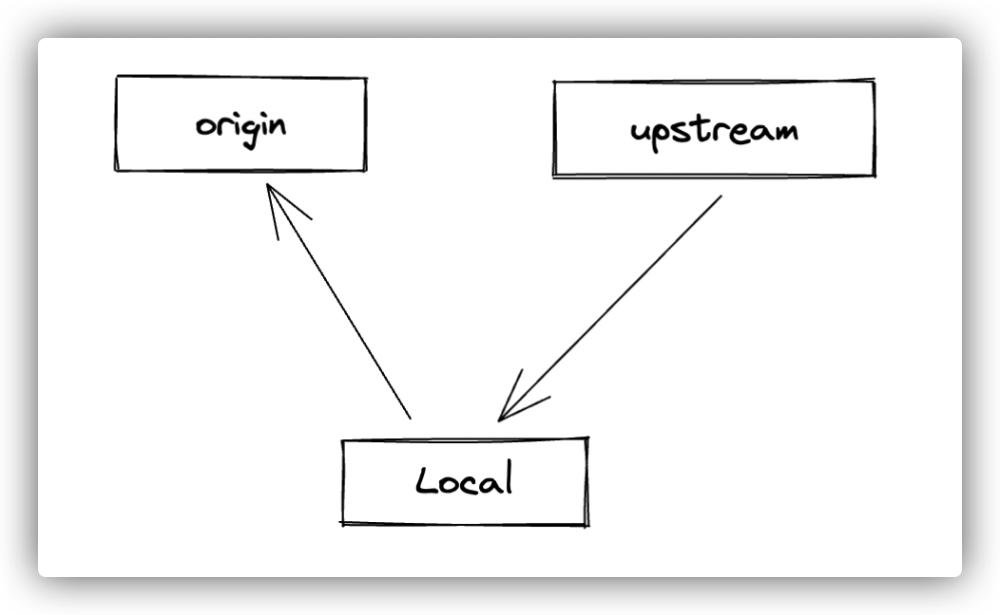

# github-3way-sync 介绍



## 场景

我们在 github 上参与开源项目开发的时候，通常来说会涉及到和 upstream 仓库同步的问题，也就是 fork 的上游仓库有更新后，我们需要同步到 fork 仓库（也就是 origin）。在网上可以搜索到很多人介绍关于如何同步 github upstream 的文章。

这里我基于 cofx 将这样一个相对还比较繁琐的同步流程给完全自动化为一个 cofx 的 workflow。我把这个自动化工作流场景命名为：github-3way-sync，也就是三路同步，三路分别是：local，origin，upstream。

## 用法

使用方法很简单，没有任何的配置项。你只需要进入本地一个 github 上 clone 的仓库，切换到 main or master 分支，然后执行如下命令：

```shell
cofx run github-3way-sync
```

注意：默认只支持在 main 或 master 分支进行同步，也就是 upstream 仓库的主分支是 main 或 master。

示范：


## FlowL 代码

github 3way sync 的 flowl 代码位于：

[https://github.com/cofxlabs/cofx/blob/main/examples/github-3way-sync.flowl](https://github.com/cofxlabs/cofx/blob/main/examples/github-3way-sync.flowl)