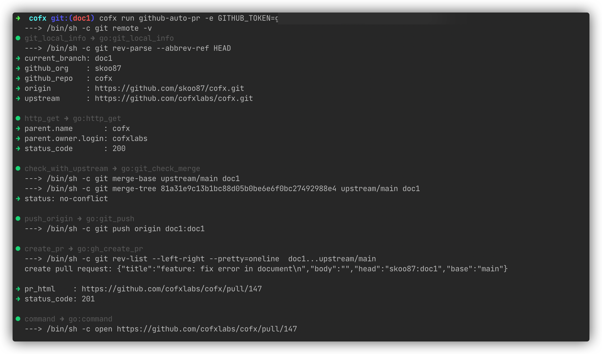

# Github-auto-pr Introduction


## Scenes

When participating in github open source projects, we always write code and create pull requests. The goal of the cofx github-auto-pr workflow is to write the code locally and submit the commit to automatically complete the creation of the final pull request. The whole process can be completed with only one command.

## Usage

Enter a local clone github project repository, checkout a development branch, and complete the code commit after completing the code development. After committing again, you can directly execute the following command to complete the automatic creation of the pull request.

```shell
cofx run github-auto-pr -e GITHUB_TOKEN=<YOUR-TOKEN>
````

After executing the github-auto-pr workflow, the local branch is first synchronized to the origin remote repository through git push, and then a pull request is created to the upstream remote repository through github api.

Note:

* github-auto-pr workflow needs to rely on github token for authentication (subsequently, cofx may provide token and password management, and optimize the scenario where token and password need to be input repeatedly for each execution).
* By default, the pull request is created to the `main` branch of the upstream repository. If you need to adjust to other branches, you need to modify github-auto-pr.flowl.

Demonstration:



## FlowL Program

The flowl program for github auto pr is at:

[https://github.com/skoowoo/cofx/blob/main/examples/github-auto-pr.flowl](https://github.com/skoowoo/cofx/blob/main/examples/github-auto-pr.flowl)